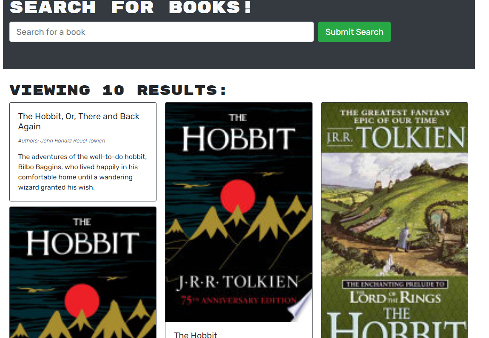
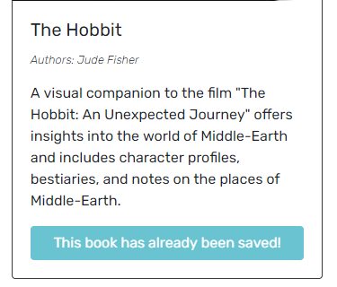

## Title: Book Search Engine

## Description: 
This App is meant to give someone the ability to search for books that they may wish to read. With this they can also Login/Signup to your App and they can save these books to their profile. They also have the functionality to remove books from their saved books.

To view the App live please go to this link: https://app-book-search-engine.herokuapp.com/

## Table of Contents: 

- [Installation](#installation)
- [Usage](#usage)
- [License](#license)
- [Contributions](#contributions)
- [Questions](#questions)

## Installation: 
- You would copy my code repo and then enter the command 'mpn run install' in the root directory.
- Once done you should be able to then launch the App in your local browser and begin searching for books.

## Usage:
As listed above the usage of this App is meant to simply be a place where you can search for books and save them to your profile.

Also to run the app be sure to check out the scripts in the main package.json.

  

  

  

  

## License: 

https://opensource.org/licenses/MIT

## Contributions: 
- DU staff
- Myself

## Questions: 
Contact me at david.faidley23@gmail.com

https://github.com/dfaidley23

Book Search Engine

